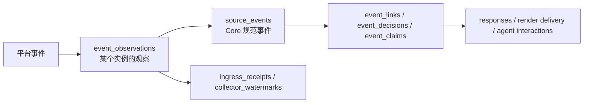

# Superlily 数据库与外部接入指南

状态：stable foundation 接入说明

最后核对：2026-08-29

适用版本：Alembic `0026_history_timeline_export`

本文面向需要读取 Superlily 数据，或把服务、Provider、机器人桥接器和脚本接入 Core 的开发者。它说明当前数据库的部署方式、数据边界和安全接入路径，但不替代协议与迁移本身：

- HTTP 载荷和行为以 [`CONTRACTS.md`](CONTRACTS.md) 及 `packages/contracts/` 为准；
- ORM 结构以 `apps/core/src/superlily_core/models.py` 为准；
- 数据库演进以 `apps/core/migrations/versions/` 下的 Alembic 迁移为准；
- 部署端口和密钥来源以 `deploy/compose.yml` 及部署环境为准。

不要把本文的表清单当作永久不变的 API。外部写入必须经过 Core HTTP API；直接 SQL 只适合受控的只读查询、报表与导出。

## 1. 当前生产快照

以下是 2026-08-29 对运行中生产栈的只读核对结果。容量和行数会继续变化；冻结身份和
已知 Core 镜像漂移见 [`R0_BASELINE.md`](R0_BASELINE.md)。

| 项目 | 当前值 |
| --- | --- |
| 数据库 | PostgreSQL 17.10 |
| 数据库名 / Schema | `superlily` / `public`、`archive` |
| Alembic head | `0026_history_timeline_export` |
| 业务表 | 86 张（所有非系统 schema） |
| 索引 / trigger | 352 / 62（`public` 与 `archive`） |
| 数据库大小 | 约 23 GB |
| 字符集 / 时区 | UTF-8 / UTC |
| 默认事务隔离 | `read committed` |
| 扩展 | 仅 `plpgsql`；未安装 `pgvector` |
| JSON 类型 | 当前使用 PostgreSQL `json`，不是 `jsonb` |
| ID / 时间 | 多数 ID 是 UUID 形态的 `varchar`；时间为 `timestamptz` |

当前主要空间来自事件采集链：`event_observations`、`event_decisions`、`event_claims`、`source_events` 和 `ingress_receipts`。因此分析脚本应使用有界时间范围和键集分页，避免无条件全表扫描或大偏移量分页。

## 2. 应选择哪一种接入方式

| 需求 | 推荐入口 | 原因 |
| --- | --- | --- |
| 上报消息、观察、心跳或响应 | Core HTTP API | 保留实例身份、幂等性、连续性和审计 |
| 注册 Provider、执行工具、提交 artifact | Core HTTP API | 租约、fence、权限快照和终态由 Core 维护 |
| 发起 AgentRun 或回报模型尝试 | Core HTTP API | 预算、模型路由、提案与工具循环由 Core 约束 |
| 运维查看近期事件和状态 | Admin HTTP API | 接口稳定且不暴露数据库凭据 |
| 批量报表、离线统计、受控导出 | 独立只读数据库角色 | 适合 SQL，但调用方必须承受 schema 演进 |
| 修改数据或 schema | 业务 API / Alembic | 禁止脚本直接修表或写业务行 |
| 获取 artifact 二进制内容 | Core 内容接口或对象存储 | PostgreSQL 主要保存元数据、hash 和溯源，不是通用 blob 仓库 |

原则很简单：**写操作走 Core；常规读取优先走 Core；只有确有 SQL 需求的受控消费者才获得只读数据库账户。**

## 3. 网络位置

默认部署拓扑：

| 使用位置 | Core | PostgreSQL |
| --- | --- | --- |
| 宿主机 | `http://127.0.0.1:8765` | `127.0.0.1:5433` |
| Compose `core` 网络 | `http://lily-core:8000` | `postgres:5432` |

数据库宿主机端口仅绑定 loopback，不应直接暴露到局域网或公网。Compose 网络内的名字只对加入相同网络的容器有效。

只读 DSN 示例（占位符不能原样使用）：

```text
postgresql://<readonly-user>:<generated-secret>@127.0.0.1:5433/superlily
postgresql://<readonly-user>:<generated-secret>@postgres:5432/superlily
postgresql+asyncpg://<readonly-user>:<generated-secret>@postgres:5432/superlily
```

不要向外部服务分发生产所有者 `superlily` 的密码。该账户由 `SUPERLILY_POSTGRES_PASSWORD` 配置，权限远高于普通消费者所需。

## 4. HTTP 身份与认证

Superlily 不是用一枚共享 token 代表所有调用者。不同入口有不同身份域：

| 身份 | 典型用途 | 约束 |
| --- | --- | --- |
| Instance bearer token | `/v1/events`、响应、心跳、claim、Agent 产品入口和文本交付 | token 精确绑定 `instance_id` |
| Tool Provider bearer token | inventory、Provider 心跳、工具 lease/start/complete/artifact | token 精确绑定 `provider_id` |
| Model Provider bearer token | planner input、模型 attempt 回报、continuation | 绑定模型 Provider 身份 |
| Admin bearer token | 近期事件、watermark、工具目录等运维读取 | 仅用于受控管理调用 |
| Control-plane session | 描述符、Provider、rollout 等控制面变更 | 另有 Host/Origin、CSRF、重新认证和 CAS 边界 |

具有副作用或持久化效果的接口通常要求 `Idempotency-Key`。当前键长为 8–256 字符，并在调用者身份范围内解释；重试应复用同一键，新的逻辑操作应生成新键。

Core 默认提供 `/openapi.json` 和 `/docs` 用于发现路由和模型。能看到 OpenAPI 不代表能绕过各路由认证。

健康检查不需要业务 token：

```bash
curl --fail http://127.0.0.1:8765/health/live
curl --fail http://127.0.0.1:8765/health/ready
```

Admin 查询示例：

```bash
curl --fail \
  -H "Authorization: Bearer ${SUPERLILY_ADMIN_TOKEN}" \
  'http://127.0.0.1:8765/v1/events/recent?limit=100'
```

不要把 token 写进源码、命令历史、日志或本文。脚本应从 secret 文件或进程环境读取，并对响应中的消息文本、原始载荷和身份字段按私密数据处理。

## 5. 数据流和核心身份

采集链的关键不是“某段文字在某个时间出现过”，而是平台事件、账号观察和 Core 规范事件之间的可审计关联：



必须遵守以下语义：

- `source_events.id` 是 Core 内的规范事件身份；跨表关联优先使用 `source_event_id`。
- `event_observations` 是一个已认证 bot instance 对事件的观察，保留 instance、spool、发送者、文本、segment、附件和原始元数据。
- 平台消息 ID 可能只在某个机器人账号的视角内有效。不要仅凭 QQ 数字消息 ID 跨实例关联。
- 不要用“文本相同 + 时间接近”自行去重。规范化、关联和 claim 的结果已有专门表和审计记录。
- `ingress_receipts` 绑定 instance、spool、sequence 和 payload hash；`collector_watermarks` 表示连续提交位置、已见位置和 gap 状态。

时间字段也不能混用：

| 字段 | 含义 |
| --- | --- |
| `occurred_at` | 平台声称事件发生的时间 |
| `captured_at` | bridge 已将事件持久写入本地 spool 的时间 |
| `received_at` | Core 收到载荷的时间 |
| `committed_at` | Core 将结果提交到数据库的时间 |

Agent 和工具链同样不允许绕过 Core：AgentRun 产生模型尝试和工具提案，只有经过资格、预算、rollout 和 authority 判定后才能形成工具调用；发送仍通过 delivery intent，而不是让模型或 Provider 直接调用平台 API。

## 6. 表域清单

### 6.1 采集与路由（13）

`bot_instances`、`source_events`、`event_observations`、`conversation_capture_profiles`、`platform_action_observations`、`ingress_receipts`、`collector_watermarks`、`event_links`、`event_decisions`、`responses`、`instance_status_transitions`、`command_registry_snapshots`、`event_claims`。

### 6.2 渲染与交付（6）

`render_documents`、`render_attempts`、`render_artifacts`、`render_delivery_plans`、`render_delivery_intents`、`render_delivery_attempts`。

### 6.3 工具与 authority 控制（20）

`tool_descriptors`、`tool_descriptor_lifecycle_events`、`tool_providers`、`tool_provider_credentials`、`tool_provider_lifecycle_events`、`tool_provider_inventory_snapshots`、`tool_provider_inventory_entries`、`tool_provider_heartbeats`、`tool_rollout_plans`、`tool_rollout_plan_items`、`tool_rollout_plan_lifecycle_events`、`tool_rollout_plan_counters`、`tool_invocations`、`tool_invocation_transitions`、`tool_confirmations`、`tool_confirmation_events`、`tool_attempts`、`tool_attempt_events`、`tool_artifacts`、`tool_artifact_events`。

### 6.4 控制面（5）

`control_plane_sessions`、`control_plane_login_attempts`、`control_plane_mutations`、`control_plane_audit_events`、`control_plane_previews`。

### 6.5 Agent（12）

`agent_model_profiles`、`agent_runs`、`agent_run_events`、`agent_run_attempts`、`agent_tool_proposals`、`agent_tool_loops`、`agent_tool_loop_events`、`agent_tool_continuations`、`agent_interactions`、`agent_interaction_events`、`agent_text_delivery_intents`、`agent_text_delivery_events`。

另有 Alembic 自己维护的 `alembic_version`。表之间的精确列、约束、索引和触发器应从当前迁移及 PostgreSQL catalog 获取，不要从此清单反向生成模型。

## 7. 只读 SQL 接入

默认部署**没有**给外部消费者预建只读角色。确有需要时，由生产操作员创建每个消费者独立的账户；不要让多个脚本共享数据库所有者账户。一个基础模板如下：

```sql
CREATE ROLE superlily_reader LOGIN PASSWORD '<generated-secret>'
  NOSUPERUSER NOCREATEDB NOCREATEROLE NOINHERIT CONNECTION LIMIT 5;

GRANT CONNECT ON DATABASE superlily TO superlily_reader;
GRANT USAGE ON SCHEMA public TO superlily_reader;
GRANT SELECT ON ALL TABLES IN SCHEMA public TO superlily_reader;

ALTER DEFAULT PRIVILEGES FOR ROLE superlily IN SCHEMA public
  GRANT SELECT ON TABLES TO superlily_reader;

ALTER ROLE superlily_reader SET default_transaction_read_only = on;
ALTER ROLE superlily_reader SET statement_timeout = '15s';
ALTER ROLE superlily_reader SET idle_in_transaction_session_timeout = '30s';
```

这只是操作模板，不是已经执行的配置。实际账户应按消费者命名，密码由 secret 管理器生成和保存，权限可以进一步收窄到指定 view 或表。撤销服务时应同时撤销账户。

每个分析事务建议再次声明保护条件：

```sql
BEGIN READ ONLY;
SET LOCAL statement_timeout = '15s';
-- SELECT ...
COMMIT;
```

### 7.1 查询近期观察

首页省略游标条件；后续页传入上一页末尾的 `received_at` 和 `id`：

```sql
SELECT
  o.id AS observation_id,
  o.source_event_id,
  o.instance_id,
  s.platform,
  s.conversation_type,
  s.conversation_id,
  s.event_type,
  s.occurred_at,
  o.received_at,
  o.sender_id,
  o.text,
  o.capture_status
FROM event_observations AS o
JOIN source_events AS s ON s.id = o.source_event_id
WHERE (o.received_at, o.id) < (:cursor_time, :cursor_id)
ORDER BY o.received_at DESC, o.id DESC
LIMIT 200;
```

应根据用途增加 `conversation_id`、时间区间或 instance 过滤。对大表不要使用不断增大的 `OFFSET`。

### 7.2 查看采集连续性

```sql
SELECT
  instance_id,
  spool_id,
  highest_contiguous_sequence,
  highest_seen_sequence,
  last_receipt_at,
  updated_at
FROM collector_watermarks
ORDER BY updated_at DESC;
```

字段名和语义在未来迁移中可能改变。长期集成应优先使用 `/v1/ingress/watermarks` 或 `/v1/ingress/status`，而不是把这个查询固化为外部协议。

## 8. 为什么禁止直接写库

许多表是 append-only，终态不可变或由状态迁移触发器保护。即使一条直接 `INSERT` 或 `UPDATE` 暂时通过数据库约束，它仍可能绕过：

- 调用者身份和权限校验；
- `Idempotency-Key` 与 payload hash 冲突检测；
- Provider lease、fence 和 heartbeat；
- descriptor、rollout 与 authority 快照；
- 预算、confirmation 单次消费和 Agent 工具循环限制；
- 配套的 lifecycle/event 审计行；
- artifact 内容校验及 delivery intent。

因此“知道表结构”不等于“获得写入协议”。需要新增写入能力时，应先在 contracts 中定义载荷和失败语义，再实现 Core service 与 route，最后通过 Alembic 演进数据库。

生产启动会运行 `alembic upgrade head`。生产环境不得调用 ORM `create_all()`，也不得由外部脚本自行 `ALTER TABLE`。

## 9. Artifact 与大对象

Render 和 tool artifact 的数据库行保存标识、状态、媒体类型、大小、摘要、来源和生命周期事件。二进制内容由 Core 管理的 artifact 存储或对象存储承载；当前部署有独立的 `superlily_artifacts` volume。

消费者应使用相应的 Core 内容接口，例如 `/v1/render-artifacts/{artifact_id}/content` 或工具 artifact 流程。不要假定二进制就在 PostgreSQL 某个 JSON 字段中，也不要直接读取 artifact volume 绕过 authorization 和完整性校验。

## 10. Schema 演进与兼容

外部 SQL 消费者需遵守以下约定：

1. 启动时读取 `alembic_version`，只接受自己验证过的版本范围。
2. 明确列名，禁止依赖 `SELECT *` 的列顺序。
3. 对枚举字符串和 JSON 增量字段保持向前兼容；未知值应记录而非崩溃。
4. 时间统一按带时区值处理，展示层再转本地时区。
5. ID 一律作为不透明字符串，不依赖 UUID 版本或 varchar 长度。
6. 查询必须有限流、超时、时间边界和分页；不要与 Core 争抢连接池或 I/O。
7. 需要长期稳定的数据产品时，在 Core 中增加受版本控制的 API 或专用 view，而不是锁死内部表布局。

## 11. 自助核对

```bash
# API 路由和数据模型
curl --fail http://127.0.0.1:8765/openapi.json

# 使用只读账户查看迁移版本
psql 'postgresql://<readonly-user>:<secret>@127.0.0.1:5433/superlily' \
  -c 'SELECT version_num FROM alembic_version;'

# 在开发环境核对迁移状态
cd apps/core
alembic current
alembic check
```

开发和测试数据库的设置见 [`DEVELOPMENT.md`](DEVELOPMENT.md)，生产部署与回滚见 [`DEPLOYMENT.md`](DEPLOYMENT.md)，事件身份与组件边界见 [`ARCHITECTURE.md`](ARCHITECTURE.md)。

## 12. 新接入检查表

- 已确认这是 API 接入还是确有必要的只读 SQL 接入；
- 已为调用方分配独立身份和最小权限，没有复用 owner/admin 密钥；
- 写请求有稳定的 `Idempotency-Key` 和明确重试策略；
- 使用 `source_event_id` 等规范身份，不按文本和时间猜测关联；
- 查询有超时、边界、键集分页和连接数限制；
- 日志会过滤 token、消息正文、raw payload 和敏感身份字段；
- 已声明支持的 Alembic 版本，并对迁移变化有升级测试；
- 没有直接写业务表、直接改 schema 或直接读取 artifact volume；
- 接入失败不会拖垮命令路径、采集路径或 Core 数据库连接池。
